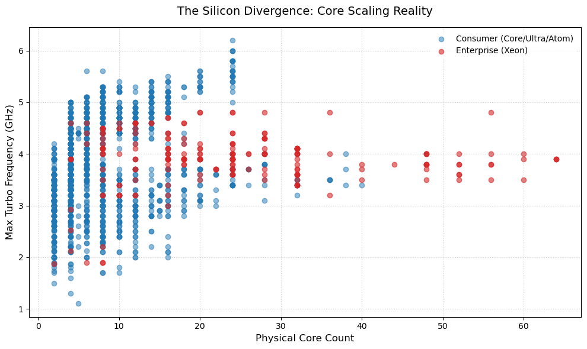

# CPU Clock Speed Prediction

Predicting Intel CPU maximum turbo frequencies using linear regression with engineered semiconductor features.

## Data

The dataset is sourced from [intel-processors](https://github.com/toUpperCase78/intel-processors) by toUpperCase78. It includes specifications across multiple Intel processor families (Atom, Celeron, Core, Core Ultra, Pentium, Xeon, and others).

## Approach

Linear regression is used to model the relationship between processor features and clock speed targets. The model iterates through nine phases, progressively introducing categorical context, physical constraints, and engineered features while preserving the linear framework required for extrapolation to future architectures.

## Structure

```
.
├── data/           # CSV datasets by processor family
├── img/            # Charts and diagrams
├── model/          # Training, prediction, and benchmarking
│   ├── predict.py  # Interactive future-CPU predictor
│   ├─── test.py    # Batch benchmark runner with 10-fold CV
│   └── test.ipynb  # Jupyter Notebook for testing
└── README.md
```

## Setup

```bash
conda create -n data python=3.12 pandas scikit-learn
conda activate data
```

## Usage

```bash
# Interactive future-CPU predictor
python model/predict.py

# Batch benchmark against real CPUs
python model/test.py
```

## Model Evolution

Predicting a CPU's maximum turbo frequency using linear regression is a challenge because silicon scaling behavior is step-conditional and heavily segmented by marketing tiers. This section outlines how the model was iteratively refined from a blunt baseline into a physically grounded extrapolation engine.

### Phase 1: The Baseline

- **Strategy:** Raw, unmapped continuous specs (`Lithography(nm)`, `Cores`, `TDP(W)`) fed into vanilla Linear Regression.
- **Metrics:** Training R-squared ~38% | Test RMSE ~0.65 GHz
- **Insight:** The model was unbiased (normally distributed residuals) but highly imprecise -- missing targets by an average of 650 MHz because it was blind to architectural differences.

### Phase 2: Segmentation and Temporal Context

- **Strategy:** Introduced `Release Date` as a temporal feature and one-hot encoded vertical product segments (Xeon, Core, Core Ultra, Pentium, Celeron).
- **Metrics:** Test R-squared ~62.3% | Test MAE 0.385 GHz
- **Insight:** A massive leap forward. By providing categorical market boundaries, the model successfully mapped distinct frequency profiles across different tiers, nearly doubling predictive accuracy.

### Phase 3: Suffix Tiering and the Brute-Force Approach

- **Strategy:** Extracted CPU SKU suffixes into performance classes (High Perf, Power Optimized, Ultra-Low Power). Tested a full feature space with 27 dummy variables.
- **Metrics:** Test R-squared 75.68% | Test MAE 0.303 GHz
- **Insight:** The inflated score was a double-edged illusion. The feature space suffered from multicollinearity (Cores vs Threads correlation of 0.98), and the model cheated by including `Base Freq.(GHz)` -- using the base clock as a deterministic shortcut. Stripping this shortcut dropped the realistic baseline to ~72%.

### Phase 4: Physics Injection

- **Strategy:** Compressed 91 marketing codenames into 26 microarchitectural families. Injected physical constraints: `L2_per_P_Core_KB`, `Is_Tiled`, `Is_Mesh`, and `Log_Node_Density`. Applied Ridge Regression to penalize unstable coefficients.
- **Metrics:** Test R-squared 66.39% | Test MAE 0.378 GHz
- **Insight:** Coefficients aligned with real-world semiconductor physics -- the model correctly penalized mesh topologies for routing overhead and high node densities for thermal limits. The 66% ceiling confirmed that a single global linear line has structural limitations across diverse hardware eras.

### Phase 5: Random Forest

- **Strategy:** Swapped the linear engine for `RandomForestRegressor` to test non-linear handling of the engineered features.
- **Metrics:** Training R-squared 95.80% | Test R-squared 85.32% | Test MAE 0.211 GHz
- **Insight:** Tree-based ensembles cannot extrapolate outside training data boundaries. Since a project goal is to project trends into future architectures, a model that flatlines at historical endpoints is non-viable.

### Phase 6: The 70% Ceiling

- **Strategy:** Returned to Ridge Regression to preserve forward-looking extrapolation. Retained engineered physical features, introduced temporal node maturity tracking (`Node_Maturity_Years`), and tuned the OLS pipeline.
- **Metrics:** Training R-squared 0.7032 | Testing R-squared 0.6851 | Test MAE 0.3680 GHz
- **Insight:** The linear model settled near 70% variance captured -- a hard structural ceiling. Consumer silicon arcs upward with core counts while server silicon slopes downward due to die size and mesh fabric drag. A single global regression line, forced to average across both domains, could push no further.

### Phase 7: Breaking the Plateau

- **Strategy:** Three simultaneous structural changes. First, the raw `Threads` column was converted into `Threads_per_Core` -- an SMT ratio that eliminated the 0.98 Cores-Threads correlation while preserving the exact thermal penalty that Hyper-Threading imposes on single-core boost clocks. Second, two per-core power metrics were engineered: `TDP_per_Core` and the `Power_Starvation_Index` (Cores^2 / TDP), giving the purely additive linear model the geometric coordinates to recognize that a 125W 8-core chip allocates far more headroom per core than a 350W 56-core server slab. Third, the entire enterprise server segment (Xeon Scalable and Xeon Legacy) was surgically removed from the training set, optimizing the pipeline exclusively for consumer desktop and mobile silicon.



- **Metrics:** Test R-squared 0.8448 | Test MAE 0.266 GHz
- **Verdict:** This was the definitive breakthrough. Linear regression is a conditional expectation engine -- it always seeks the optimal average. By removing the Xeon domain, the model was freed from forcing a mediocre compromise line between two opposing physical realities. The per-core ratio features gave the straight line the curvature it structurally lacks, and the SMT ratio resolved the multicollinearity that had silently destabilized coefficients since Phase 3. The result is a purely linear, consumer-optimized extrapolation engine with genuine predictive range into future architectures.

### Phase 8: Asymmetric Hybrid Architecture Overhaul

- **Strategy:** Completely rebuilt the feature engineering layer to account for modern asymmetric hybrid processors (P-cores + E-cores). Injected a `P-Cores` column parsed automatically from product naming conventions across all datasets. Introduced `P_Core_Ratio` (P-Cores divided by total Cores) to replace raw core counts with a structural composition metric, capturing whether a die is monolithic or hybrid. Engineered `TDP_per_PCore` to isolate the thermal budget available to active single-core execution blocks, preventing background E-core clusters from diluting power-delivery signals. Added a vectorized conditional fallback via `np.where` to handle zero P-core budgets safely on ultra-low-power parts.
- **Metrics:** Test R-squared **0.8465** | Test MAE **0.2675 GHz**
- **Benchmark validation:** A blind test suite of 26 processors spanning distinct eras, segments, and architectural limits yielded MAE of 0.303 GHz and mean absolute percentage error of 7.7%. The model predicts flagship hybrid configurations within sub-2% error (Core Ultra 9 285K: 0.3%, i9-14900KS: 1.8%, i5-13600K: 0.8%, i7-12700K: 1.4%).
- **Benchmarks:** 
A blind validation suite of 26 processors from distinct eras, segments, and architectural limits was evaluated against the Phase 8 Ridge model (consumer-only, 970 training samples).

```
  CPU                                            Actual    Pred     Err   %Err
--------------------------------------------------------------------------------
  Intel Core i7-920                               2.93G   3.58G +0.649  22.2%
  Intel Core i7-2700K                             3.90G   3.66G -0.237   6.1%
  Intel Core i7-3770K                             3.90G   3.56G -0.336   8.6%
  Intel Core i7-4790K                             4.40G   3.96G -0.440  10.0%
  Intel Core i7-5775C                             3.70G   3.86G +0.156   4.2%
  Intel Core i7-6700K                             4.20G   3.98G -0.218   5.2%
  Intel Core i7-7700K                             4.50G   4.32G -0.176   3.9%
  Intel Core i5-8400                              4.00G   4.10G +0.104   2.6%
  Intel Core i9-9900K                             5.00G   4.50G -0.500  10.0%
  Intel Core i9-10900K                            5.30G   4.96G -0.342   6.5%
  Intel Core i7-11700K                            5.00G   5.02G +0.017   0.3%
  Intel Core i3-12100F                            4.30G   4.64G +0.345   8.0%
  Intel Core i5-12400                             4.40G   4.68G +0.284   6.5%
  Intel Core i7-12700K                            5.00G   4.93G -0.069   1.4%
  Intel Core i5-13600K                            5.10G   5.14G +0.042   0.8%
  Intel Core i9-14900KS                           6.20G   6.09G -0.114   1.8%
  Intel Core Ultra 7 155U                         4.80G   4.46G -0.335   7.0%
  Intel Core Ultra 5 125H                         4.50G   4.82G +0.315   7.0%
  Intel Core Ultra 9 285K                         5.70G   5.72G +0.018   0.3%
  Intel Core Ultra 7 258V                         4.80G   4.38G -0.422   8.8%
  Intel Pentium Gold 8505                         4.40G   3.53G -0.872  19.8%
  Intel Processor N95                             3.40G   3.12G -0.276   8.1%
  Intel Core i3-N300                              3.80G   4.46G +0.658  17.3%
  Intel Pentium Silver N6005                      3.30G   3.55G +0.249   7.5%
  Intel Core m3-7Y30                              2.60G   3.27G +0.669  25.7%
  Intel Core i7-6950X                             4.00G   3.96G -0.042   1.0%
--------------------------------------------------------------------------------
  MAE across 26 CPUs with known turbo: 0.303 GHz  |  Max abs error: 0.872 GHz
  Mean |%error|: 7.7%
```
- **Verdict:** Domain-specific feature engineering decisively outperforms blind hyperparameter tuning. By altering how the model parses CPU core composition, a basic linear Ridge regression was elevated into an explainable, deterministic physics calculator that captures nearly 85% of clock scaling variance across two decades of consumer silicon.

### Phase 9: Polynomial Expansion & Rigorous Cross-Validation

- **Strategy:** Earlier phases relied on a single 80/20 train-test split and manual alpha tuning -- a workflow that, while productive for rapid iteration, carried a hidden risk: repeatedly tweaking features and hyperparameters against the same held-out fold can silently overfit the pipeline to specific future targets (e.g. Nova Lake), making it impossible to objectively compare two competing model architectures. To eliminate this, the entire evaluation framework was rebuilt around two methodological safeguards. First, **10-Fold Cross-Validation** replaced the single split, producing a true out-of-sample R-squared and MAE with honest standard deviations across all 970 consumer CPUs. Second, hyperparameter selection was handed off to **nested RidgeCV** -- the regularization strength alpha is now chosen purely by the data through an inner cross-validation loop, removing the human from the tuning knob entirely. With the evaluation framework locked down, the linear feature set was expanded via **degree-2 polynomial features** (PolynomialFeatures(degree=2, include_bias=False)), exploding the 32-column feature space into 594 interaction and squared terms while keeping the underlying estimator a penalized Ridge regression.
- **Metrics (10-Fold CV, 970 samples):**
  - Polynomial RidgeCV (alpha selected automatically, median ~628): **True Avg R-squared = 0.8764 +/- 0.0269** | **True Avg MAE = 0.2276 +/- 0.0226 GHz**
- **Verdict:** This phase was less about chasing a higher number and more about earning the right to trust it. The polynomial expansion delivered a genuine 3-point R-squared gain over the linear model (0.876 vs 0.846) while tightening the error bars -- the +/- 0.027 standard deviation on R-squared confirms the model generalizes stably across all 10 folds. More importantly, the switch to nested cross-validation with RidgeCV means that when someone asks "did you tune alpha to make the numbers look good?", the answer is no: the data chose alpha approximately 628 on its own, with zero human steering. The lesson: rigorous evaluation is extremely important to evaluate any model.
- **Nova Lake Prediction**:  
  - Lithography(nm)       : 2
  - Cores                 : 52
  - Threads               : 52
  - TDP(W)                : 170 (PL1)
  - Release Year          : 2026
  - L2 per P-core (KB)    : 3072 (4MB is to be shared across 2 P-Cores; 3MB is an estimate for the effective L2 Cache per P-Core)
  - Is Tiled? (0/1)       : 1
  - Is Mesh?  (0/1)       : 0
  - Node Density (MTr/mm2) : 230 (Estimate for N2P)
  - Node Maturity (years) : 0
  - P-Cores               : 16
  - Family: Core Ultra
  - Power Tier: High Perf
  > Predicted Max. Turbo Freq.:  5.641 GHz  (~5641 MHz)
## Feature Set

**Target:** `Max. Turbo Freq.(GHz)`

### Raw Specifications

| Feature | Description |
|---|---|
| `Lithography(nm)` | Manufacturing process node size |
| `Cores` | Physical core count |
| `TDP(W)` | Thermal Design Power |
| `Release Year` | Year of launch (extracted from release string) |

Raw `Threads` is collected at input but converted to the ratio `Threads_per_Core` before entering the model, resolving the Cores-Threads correlation.

### Engineered Physical Features

| Feature | Description |
|---|---|
| `L2_per_Core_KB` | L2 cache per P-core, mapped from microarchitecture lookup tables |
| `Is_Tiled` | Binary flag for MCM / Foveros tiled packaging |
| `Is_Mesh` | Binary flag for server mesh interconnect topology |
| `Log_Node_Density` | Log-transformed estimated transistor density (MTr/mm2) |
| `Node_Maturity_Years` | Years elapsed since the process node was first introduced |

### Derived Per-Core Ratios

| Feature | Description |
|---|---|
| `TDP_per_Core` | TDP divided by Cores -- localized thermal headroom per core |
| `Threads_per_Core` | Threads divided by Cores -- SMT ratio capturing Hyper-Threading overhead |
| `Power_Starvation_Index` | Cores squared divided by TDP -- penalizes high core counts on thin power envelopes |
| `P_Core_Ratio` | P-Cores divided by total Cores -- structural composition ratio for hybrid dies |
| `TDP_per_PCore` | TDP divided by P-Cores -- thermal budget available to active single-core execution blocks |

### Interaction Features

| Feature | Description |
|---|---|
| `Cores_x_Is_Mesh` | Cores multiplied by mesh flag to capture mesh routing overhead |
| `TDP_x_Is_Tiled` | TDP multiplied by tiled packaging flag |

### One-Hot Encoded Groups

| Group | Levels | Dummies |
|---|---|---|
| `Vertical Segment` | Atom, Celeron, Core, Core Ultra, Intel, Pentium (6 levels; Xeon excluded from training) | 5 |
| `Power Tier` | Embedded, Extreme Low Power, High Perf, High Perf Mobile, Low Power, Mobile (Legacy), No Graphics, Power Optimized, Standard, Standard / Graphics, Ultra-Low Power, BGA / Soldered (12 levels) | 11 |

**Total: 33 columns** (16 numeric + 17 dummy). All numeric features are standardized via `StandardScaler` before training.


## License

Data attributed to [toUpperCase78/intel-processors](https://github.com/toUpperCase78/intel-processors). Code under MIT.
